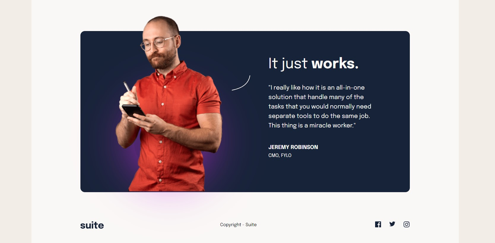

# Frontend Mentor - Suite landing page solution

This is a solution to the [Suite landing page challenge on Frontend Mentor](https://www.frontendmentor.io/challenges/suite-landing-page-tj_eaU-Ra). Frontend Mentor challenges help you improve your coding skills by building realistic projects.

## Table of contents

- [Overview](#overview)
  - [The challenge](#the-challenge)
  - [Screenshot](#screenshot)
  - [Links](#links)
- [My process](#my-process)
  - [Built with](#built-with)
  - [What I learned](#what-i-learned)
  - [Continued development](#continued-development)
  - [Useful resources](#useful-resources)
- [Author](#author)
- [Acknowledgments](#acknowledgments)


## Overview

### The challenge

Users should be able to:

- View the optimal layout depending on their device's screen size
- See hover states for interactive elements

### Screenshots

Captures made at a desktop screen zoom of 80%. The upper and lower view of the page.

- Screenshot 1


- Screenshot 2




### Links

- Solution URL: Pending
- Live Site URL: Pending

## My process

### Built with

- Semantic HTML5 markup
- CSS custom properties
- Flexbox
- Mobile-first workflow


### What I learned

- It was a refresh of dealing with Figma system, latest version. For this particular project, having the Figma design at hand is a MUST, for having accurate dimensions and distances.

- Had to find out how to modify svg images color on mouse hover. First, avoid using img src="image.svg" in the html. Instead, write the svg definitions (a long code), just wrapped by a div with a class name. Then apply the css code as below, given that the svg items were each wrapped with class = "facebook", "twitter, and "instagram", respectively, in the html.

```css
.facebook,
.twitter,
.instagram {
  cursor: pointer;
}

.facebook:hover path {
  fill: var(--gray);
}

.twitter:hover path {
  fill: var(--gray);
}

.instagram:hover path {
  fill: var(--gray);
}
```

- Regarding the "aura" behind Jeremy's image, had to find out a solution using box-shadow. Not sure if it's the best solution, but it looks no bad anyway.


### Continued development


Continue improving my coding skills by developing challenging applications, like this one.

### Useful resources

- [CSS color gradient generator](https://cssgradient.io/) - This time,  it provided the code snippet for one of the buttons background color. A good resource for using in future projects. 


## Author


- Website - [Guillermo Dominguez](https://gdominguez-portfolio.netlify.app)
- Frontend Mentor - [@memominguez](https://www.frontendmentor.io/profile/memominguez)


## Acknowledgments


Thanks to all those who share their knowledge, free of charge, through video tutorials in the youtube platform.
